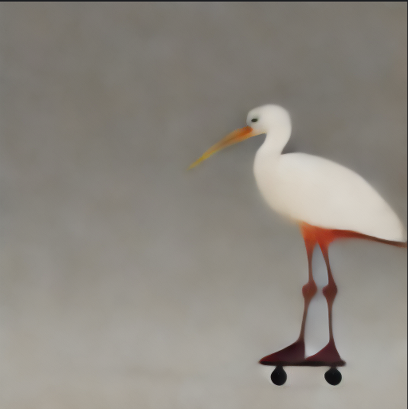

# min_DDS
Minimal implementation of Delta Denoising Score 

To-do
- [x] Implement zero-shot SDS for image editing
- [x] Implement zero-shot DDS for image editing
- [ ] Implement DDS with mask for image editing

# How to use 
Change the number of iterations and guidance in `main.py`

```
python main.py
```
## Method

- Our objective: synthesize an output image $`z`$ that incorporates the structure and details of an input source image $`\bar{z}`$ while conforming to the content specified in a target prompt $`y`$
### SDS for image editing
For image editing task,  initialize the optimization variable with the source image $`z_0=\bar{z}`$ and apply SDS while conditioning on $`y`$, however we have observed this approach leads to blurred output and a loss of details

```math
\triangledown_\theta \mathcal{L}_{SDS}(z, y, \epsilon, t)=\epsilon_\phi\left((z_t, y, t) - \epsilon \right) \frac{dz_t}{d\theta}
```

The main idea of SDS is leveraging a pretrained diffusion model to measure the plausibility of rendered images function $`g_\theta(x)`$, if the training of the diffusion model has converged, the loss for real data $x_0$ will be close to zero

### DDS for image editing

Given image $\bar{z}$ and reference prompt $\bar{y}$, we want to output image $z$ follow the query prompt $y$. The DDS score
  
```math
\triangledown_\theta \mathcal{L}_{DDS} = (\epsilon_\phi(z_t, y, t) - \epsilon_\phi(\bar{z}_t, \bar{y}, t)) \frac{dz}{d\theta}
```

If we adding and subtracting $\epsilon$ from the term in DDS loss we can represent DDS as a different between two SDS scores

```math
\triangledown_\theta \mathcal{L}_{DDS} = \triangledown_\theta \mathcal{L}_{SDS} (z_t, y, t) - \triangledown_\theta \mathcal{L}_{SDS}(\bar{z}_t, \bar{y}, t)
```

The idea behind is that score should be zero when calculate on pairs of matched prompts and images, if the score is non-zero, its gradient can be attributed to the error component

## Implementation 

- We can prevent `nan`, `posinf`, `neginf` in gradient using `torch.nan_to_num()` 
- Because we ignore the jacobian term, we don't take gradient through the UNet model -> implement stop gradient operator using `.detach()` method

# Example

Real Image


Ref prompt: "a flamingo rollerskating", query prompt: "a stork rollerskating"

Edit image using DDS


Edit image using SDS


